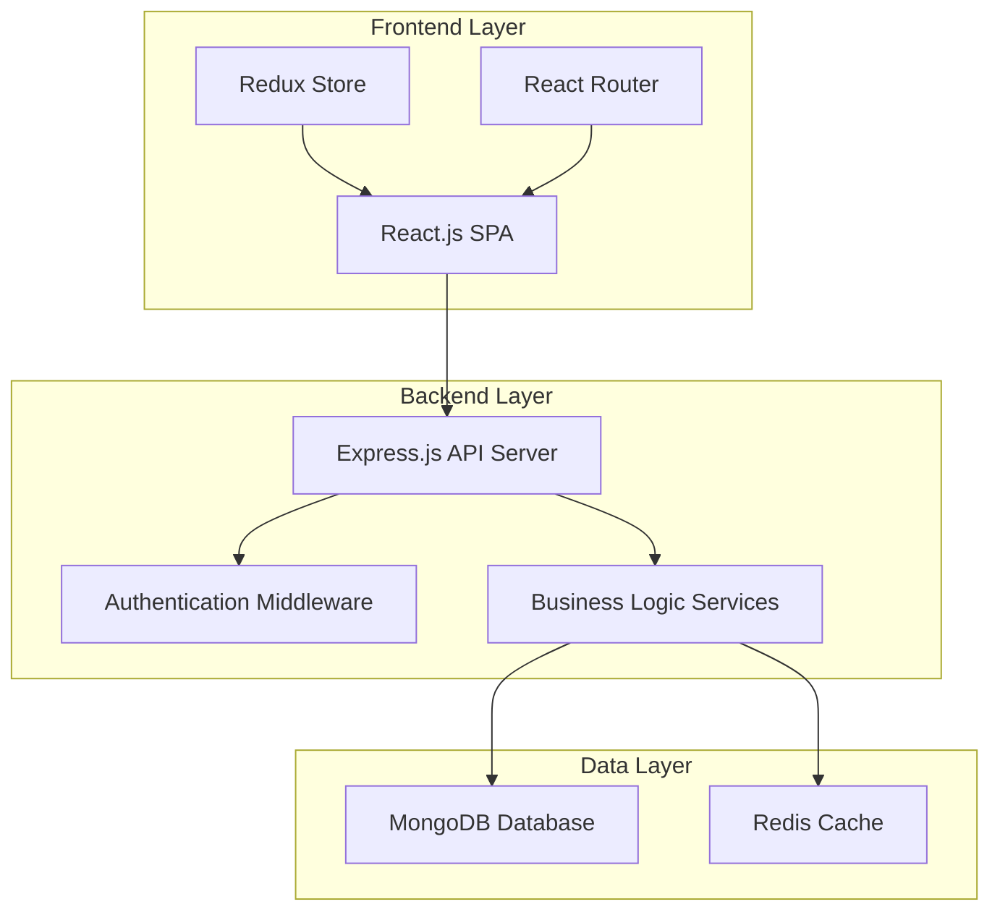

# Food Ordering Platform - Design Document

## Overview

The food ordering platform is a full-stack web application built with React.js frontend and Node.js/Express backend, utilizing MongoDB for data persistence. The system implements a microservices-inspired architecture with clear separation between authentication, inventory management, cart operations, and order processing.

## Architecture

### System Architecture



### Technology Stack

**Frontend:**

- React.js 18+ with TypeScript
- Redux Toolkit for state management
- React Router for navigation
- Axios for API communication
- Tailwind CSS for styling
- React Hook Form for form handling

**Backend:**

- Node.js with Express.js framework
- TypeScript for type safety
- JWT for authentication
- bcrypt for password hashing
- Mongoose for MongoDB ODM
- Redis for session storage and caching

**Database:**

- MongoDB for primary data storage
- Redis for caching and session management

**Security:**

- HTTPS enforcement
- CORS configuration
- Rate limiting
- Input validation and sanitization
- JWT token-based authentication

## Components and Interfaces

### Frontend Components

#### Core Components

1. **App Component**: Main application wrapper with routing
2. **AuthProvider**: Context provider for authentication state
3. **ProtectedRoute**: Route wrapper for authenticated pages
4. **Layout**: Common layout with header, navigation, and footer

#### Feature Components

1. **Authentication Components**

   - LoginForm: User login interface
   - RegisterForm: User registration interface
   - AuthGuard: Authentication state management

2. **Inventory Components**

   - CategoryFilter: Category selection interface
   - ItemGrid: Display grid of food items
   - ItemCard: Individual item display with add-to-cart
   - StockIndicator: Real-time stock status display

3. **Cart Components**

   - CartSidebar: Sliding cart interface
   - CartItem: Individual cart item with quantity controls
   - CartSummary: Order total and breakdown display

4. **Checkout Components**

   - CheckoutForm: Order confirmation interface
   - OrderSummary: Final order review
   - PaymentSimulator: Mock payment processing

5. **Order Management Components**
   - OrderHistory: List of user's previous orders
   - OrderDetails: Detailed view of specific order
   - OrderStatus: Delivery status indicator

### Backend API Endpoints

#### Authentication Endpoints

```
POST /api/auth/register - User registration
POST /api/auth/login - User login
POST /api/auth/logout - User logout
GET /api/auth/profile - Get user profile
PUT /api/auth/profile - Update user profile
```

#### Inventory Endpoints

```
GET /api/inventory/items - Get all items with optional category filter
GET /api/inventory/items/:id - Get specific item details
GET /api/inventory/categories - Get all available categories
PUT /api/inventory/items/:id/stock - Update item stock (admin)
```

#### Cart Endpoints

```
GET /api/cart - Get user's cart contents
POST /api/cart/add - Add item to cart
PUT /api/cart/update - Update cart item quantity
DELETE /api/cart/remove/:itemId - Remove item from cart
DELETE /api/cart/clear - Clear entire cart
```

#### Order Endpoints

```
POST /api/orders/checkout - Process cart checkout
GET /api/orders/history - Get user's order history
GET /api/orders/:orderId - Get specific order details
PUT /api/orders/:orderId/status - Update order status (admin)
```

## Data Models

### User Model

```typescript
interface User {
  _id: ObjectId;
  email: string;
  password: string; // hashed
  firstName: string;
  lastName: string;
  phone?: string;
  address?: {
    street: string;
    city: string;
    state: string;
    zipCode: string;
  };
  createdAt: Date;
  updatedAt: Date;
}
```

### Food Item Model

```typescript
interface FoodItem {
  _id: ObjectId;
  name: string;
  description: string;
  category: "Fruit" | "Vegetable" | "Non-veg" | "Breads" | "Other";
  price: number;
  stock: number;
  imageUrl?: string;
  isActive: boolean;
  createdAt: Date;
  updatedAt: Date;
}
```

### Cart Model

```typescript
interface Cart {
  _id: ObjectId;
  userId: ObjectId;
  items: CartItem[];
  createdAt: Date;
  updatedAt: Date;
}

interface CartItem {
  itemId: ObjectId;
  quantity: number;
  priceAtAdd: number; // Price when item was added to cart
}
```

### Order Model

```typescript
interface Order {
  _id: ObjectId;
  orderId: string; // Unique tracking ID
  userId: ObjectId;
  items: OrderItem[];
  totalAmount: number;
  status: "pending" | "confirmed" | "preparing" | "delivered" | "cancelled";
  paymentStatus: "pending" | "completed" | "failed";
  deliveryAddress: Address;
  createdAt: Date;
  updatedAt: Date;
}

interface OrderItem {
  itemId: ObjectId;
  name: string;
  quantity: number;
  price: number;
  totalPrice: number;
}
```

## Error Handling

### Frontend Error Handling

1. **API Error Interceptor**: Centralized error handling for API responses
2. **Error Boundary**: React error boundaries for component-level error catching
3. **Form Validation**: Real-time validation with user-friendly error messages
4. **Network Error Handling**: Offline detection and retry mechanisms

### Backend Error Handling

1. **Global Error Middleware**: Centralized error processing and logging
2. **Validation Errors**: Structured validation error responses
3. **Authentication Errors**: Proper HTTP status codes for auth failures
4. **Database Errors**: Graceful handling of database connection issues
5. **Rate Limiting**: Protection against API abuse

### Error Response Format

```typescript
interface ErrorResponse {
  success: false;
  error: {
    code: string;
    message: string;
    details?: any;
  };
  timestamp: string;
}
```

## Testing Strategy

### Frontend Testing

1. **Unit Tests**: Jest and React Testing Library for component testing
2. **Integration Tests**: Testing component interactions and API integration
3. **E2E Tests**: Cypress for complete user journey testing
4. **Accessibility Tests**: Automated accessibility testing with axe-core

### Backend Testing

1. **Unit Tests**: Jest for individual function and service testing
2. **Integration Tests**: Supertest for API endpoint testing
3. **Database Tests**: In-memory MongoDB for isolated database testing
4. **Load Tests**: Artillery.js for performance and concurrency testing

### Test Coverage Goals

- Minimum 80% code coverage for critical business logic
- 100% coverage for authentication and payment processing
- Complete E2E test coverage for core user journeys

## Security Considerations

### Authentication Security

1. **Password Security**: bcrypt hashing with salt rounds
2. **JWT Security**: Short-lived access tokens with refresh token rotation
3. **Session Management**: Redis-based session storage with expiration
4. **Multi-device Support**: Device fingerprinting for session validation

### Data Protection

1. **Input Validation**: Joi schema validation for all API inputs
2. **SQL Injection Prevention**: Mongoose ODM with parameterized queries
3. **XSS Protection**: Content Security Policy and input sanitization
4. **CSRF Protection**: SameSite cookies and CSRF tokens

### Infrastructure Security

1. **HTTPS Enforcement**: SSL/TLS encryption for all communications
2. **CORS Configuration**: Restricted cross-origin resource sharing
3. **Rate Limiting**: API rate limiting to prevent abuse
4. **Environment Variables**: Secure configuration management

## Performance Optimization

### Frontend Optimization

1. **Code Splitting**: React.lazy for route-based code splitting
2. **Image Optimization**: Lazy loading and responsive images
3. **Caching Strategy**: Service worker for offline functionality
4. **Bundle Optimization**: Webpack optimization for smaller bundles

### Backend Optimization

1. **Database Indexing**: Optimized indexes for frequent queries
2. **Caching Layer**: Redis caching for frequently accessed data
3. **Connection Pooling**: MongoDB connection pooling
4. **Response Compression**: Gzip compression for API responses

### Real-time Features

1. **Stock Updates**: WebSocket connections for real-time stock updates
2. **Cart Synchronization**: Real-time cart sync across devices
3. **Order Status**: Live order status updates

## Scalability Considerations

### Horizontal Scaling

1. **Stateless API Design**: Stateless backend services for easy scaling
2. **Load Balancing**: Application load balancer configuration
3. **Database Sharding**: MongoDB sharding strategy for large datasets
4. **CDN Integration**: Content delivery network for static assets

### Monitoring and Logging

1. **Application Monitoring**: Performance metrics and error tracking
2. **Database Monitoring**: Query performance and connection monitoring
3. **User Analytics**: User behavior tracking and conversion metrics
4. **Health Checks**: Automated health monitoring and alerting
